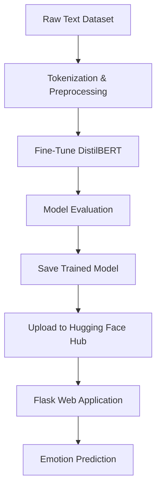

# 🔥 Fine-Tuning DistilBERT for Emotion Classification


## 📌 Project Overview
This project demonstrates end-to-end fine-tuning of DistilBERT for emotion classification and its deployment as a production-ready web application. The system transforms raw textual input into emotion predictions using a fine-tuned transformer model, enabling real-time emotional analysis through a clean and lightweight web interface.

## 🧠 Research Abstract
This project presents a fine-tuned DistilBERT model for multi-class emotion classification. Leveraging transfer learning, the model adapts contextual representations from a pre-trained transformer to capture nuanced emotional expressions in text. The fine-tuned model is deployed via a Flask-based application that enables real-time inference. The approach demonstrates how transformer-based architectures can be efficiently adapted for emotion recognition tasks while maintaining strong performance and deployment scalability.

## 🎯 Why Fine-Tune DistilBERT?
Fine-tuning allows a general-purpose language model to specialize in emotion recognition. This process significantly improves classification accuracy over zero-shot approaches by learning task-specific linguistic patterns. DistilBERT provides an ideal balance between performance and efficiency, enabling low-latency inference suitable for real-world applications.

## 🧩 Fine-Tuning Pipeline


## 🗂️ Project Structure
```cpp
fine-tuning-distilbert-emotion-classification/
│
├── fine_tune_distilbert_emotions_dataset.ipynb
├── app.py
├── requirements.txt
├── templates/
│   └── index.html
├── static/
│   └── css/
│       └── style.css
└── README.md
```

## ⚙️ Setup and Execution

Clone the repository and install dependencies:
```bash
git clone https://github.com/shaadclt/fine-tune-distilbert-emotion-classification.git
cd fine-tune-distilbert-emotion-classification
pip install -r requirements.txt
```

Run the application:
```bash
python app.py
```

Access the app at:
```cpp
http://127.0.0.1:5000
```

## ☁️ Model Hosting

The trained model is hosted on Hugging Face Hub and automatically downloaded during runtime. This keeps the repository lightweight while enabling seamless deployment to cloud platforms such as Render, Railway, or AWS.

## 🧪 Technologies Used

Python · Hugging Face Transformers · PyTorch · Flask · HTML · CSS · Google Colab

## 🎯 Key Outcomes

This project demonstrates end-to-end expertise in fine-tuning transformer models, deploying production-grade NLP systems, and building scalable machine learning pipelines suitable for real-world applications.

## 📌 Keywords for ATS Optimization

`Machine Learning`, `Natural Language Processing`, `NLP`, `Transformers`, `DistilBERT`, `Fine-Tuning`, `Emotion Classification`, `Deep Learning`, `PyTorch`, `Flask`, `Model Deployment`, `AI Engineering`

👨‍💻 Author

**Mohamed Shaad**
Machine Learning Engineer | NLP & Generative AI
LinkedIn: https://linkedin.com/in/mshaadk
